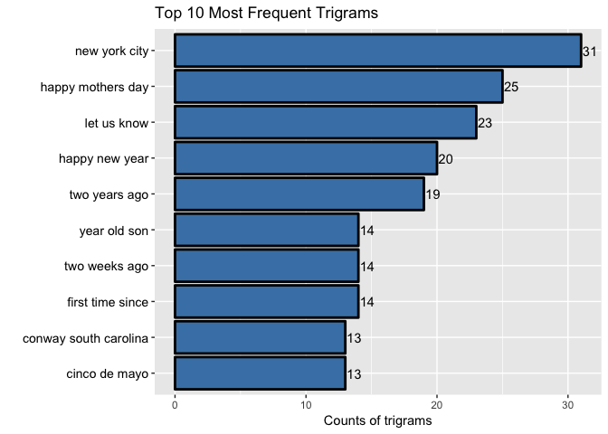

# Milestone Report on Building a Predictive Text Model
phyhouhou  
2/16/2017  

##Overview
This report serves as a milestone report for the predictive text model for the capstone project in the data science specialization courses. The complete original capstone data is downloaded from the [link](https://d396qusza40orc.cloudfront.net/dsscapstone/dataset/Coursera-SwiftKey.zip). It contains four folders in English, German, Russian and Finnish. This project will use the English database. An exploratory analysis after downloading, summarizing and sampling the raw data is performed. A brief description of plans for creating the prediction algorithm and Shiny App is also provided.

##Download and explore data
We first download and unzip the raw data. We use the English text files included in the folder 'en_US', namely, 'en_US.blogs.txt', 'en_US.news.txt', and 'en_US.twitter.txt' as our working database. Then we read the text files into R with the readLines( ) function, which reads each line as a separate character vector. The size of each text file (in megabyte (MB)) and the number of lines, the number of words, the number of numbers are summarized in the table below:

Table: A summary of text files

           Size_MB      Lines      Words       Nums  
--------  ----------  ---------  ----------  --------
Blog       200.4242    899288     37334147    157373 
News       196.2775    1010242    34372530    306583 
Twitter    159.3641    2360148    30373603    191792 

The table above shows that the dataset is fairly large. We need to sample a smaller subset of the data. An estimate of 'Words/Lines' indicates that blog files tend to use long stentences while twitter files tend to use short sentences. An estimate of 'Nums/Words' reveals that the News data tend to use more numbers than blog or twitter data.

Based on the summary, we will use a smaller subset of the data and create a separate sample dataset. We choose to randomly select 1% samples from each text file and combine them as a whole.

##Exploratory analysis 

We will perform an exploratory analysis on the sample data in this section. First we will create a corpus and make it tidy. Data cleaning includes the following processes: eliminating emojis, urls, replacing common contractions and abbreviations with their long forms, converting words to its lower case and removing [bad words]('http://www.bannedwordlist.com/lists/swearWords.txt') and stopwords in English (for the purpose of this milestone report), replacing punctuations with space (to avoid some combined strange words), removing numbers and white spaces. We will also remove single letters generated due to removing punctuations, i.e., 's', 'd' et al. We will make functions to perform the specific tasks below.

After these cleaning procedures, we will explore different sets of n-grams (a contiguous sequence of n items from a given sequence of text or speech, from [wiki](https://en.wikipedia.org/wiki/N-gram)). We will build a 2-column data frame ordered by words' frequencies.  

As an example, we illustrate the frequency of the top 10 most frequent words in a barplot.

<!-- -->

We also create a word cloud to qualitatively show the distributions of words in the text file.

<!-- -->

##Make bigrams
We first define a n-gram generator and then build bigrams and make a barplot to show the top 10 most frequent bigrams and build a wordcloud for a more qualitative view.

<!-- --><!-- -->

##Make trigrams

In analogy to unigrams and bigrams, we make trigrams and visulize them in a barplot and wordcloud.
<!-- --><!-- -->

##Goals for the eventual app and algorithm

We have performed an exploratory analysis of the text files in previous section. As the next step, we need to think better way of cleaning the corpus. After that we will build a table of unique ngrams by frequencies. The next word will be predicted based on the previous 1, 2, or 3 words. In case of unseen ngrams that do not appear in the corpora we will use the backoff algorithm. We need to evaluate precision of our prediction model and we also need to consider the code's efficiency to make it a user-friendly shiny app.

